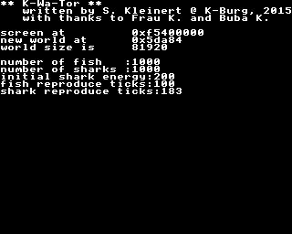

# WatorC

A high speed implementation of the [wa-tor](https://en.wikipedia.org/wiki/Wa-Tor) simulation for RISC OS.

Written using the AcornC/C++ DDE.

You need a 320x256px capable machine and/or AnyMode for this program to work unmodified.

Caution! for performance reasons, this thing uses the framebuffer directly. 
It runs fine on my raspberry pi running risc os 5.24, your mileage may vary...

good starting values:

- number of fish        1000
- number of sharks      1000
- initial shark energy   200
- fish reproduce ticks   100
- shark reproduce ticks  180

or

- 1000 / 1000 / 100 / 50 / 90
- 1000 / 50 / 20 / 30 / 40
- 1000 / 100 / 12 / 10 / 14
- 500 / 400 /10 / 5 / 20
